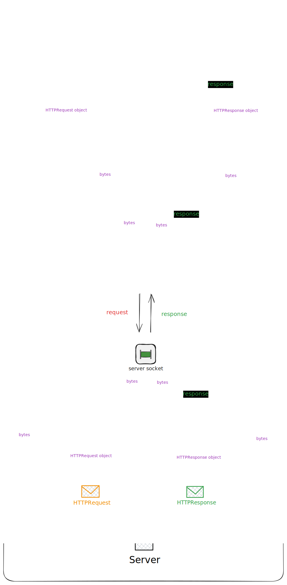
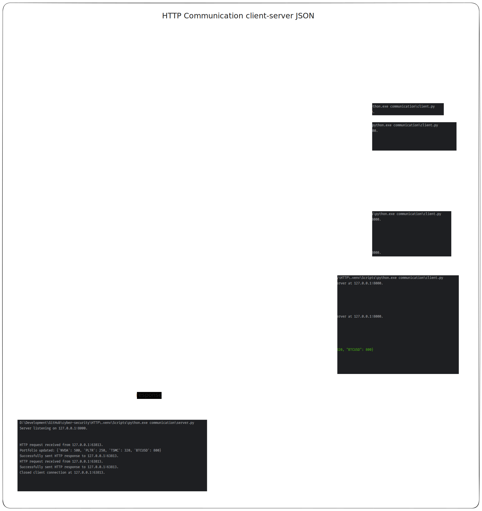

# HTTP Communication Simulation

## Overview
This project is part of a cybersecurity course and provides a set of Python classes to facilitate HTTP communication between a client and a server. The key components of this project handle HTTP request and response creation, parsing, and communication over a network. 

The project is designed to simulate the interaction between a client and a server using HTTP, providing a reusable framework for building HTTP-based systems. This can be integrated into other projects such as API development, server-client communication systems, and more.

## Project Components
1. **HTTPRequest**: Handles the creation and serialization of HTTP requests, including method, URI, headers, and body.
2. **HTTPResponse**: Handles the creation and serialization of HTTP responses, including status code, message, headers, and body.
3. **HTTPEndpoint**: Represents an HTTP endpoint with the URI, method (GET, POST, etc.), and the corresponding function to handle the request.
4. **HTTPServer**: A server implementation that listens for incoming connections, receives HTTP requests, processes them, and sends back appropriate HTTP responses.
5. **Utility Functions**: Functions like `load_request` and `load_response` are used to parse raw HTTP request and response data into usable Python objects.

## Features
- **HTTP Request & Response Handling**: Easily simulate HTTP communication, create requests, and send responses in the correct format.
- **Customizable Endpoints**: You can define your endpoints and connect them with the corresponding functions to handle specific HTTP methods.
- **Keep-Alive Connection**: Handles `Keep-Alive` connections and customizable timeout and max request parameters.
- **Server Simulation**: Run a basic server to handle client requests, simulate responses, and close connections.

## Architecture Diagram
The following diagram illustrates the architecture of the HTTP communication system:



## Input/Output Examples




## Example Usage

### Server Example

To set up the HTTP server and handle requests, you can create an instance of the `HTTPServer` class. Here's an example of how to use it:

```python
from server import HTTPServer
from endpoint import HTTPEndpoint

server = HTTPServer(("127.0.0.1", 8000))

endpoints = [
    HTTPEndpoint("/portfolio", "GET", get_portfolio),
    HTTPEndpoint("/portfolio", "POST", post_stock),
]

server.host()

while True:
    request = server.receive()
    response = respond(request, endpoints)
    server.send(response)

    server.close()
```

### Client Example

Here's a simple example of how you could create an HTTP request and simulate sending it to a server:

```python
import socket
import json

from request import HTTPRequest

client = socket.socket()
client.connect(("127.0.0.1", 8000))

portfolio = {
    "NVDA": 500,
    "PLTR": 250,
    "TSMC": 320,
    "BTCUSD": 800,
}

body = json.dumps(portfolio)

http_request = HTTPRequest(
    method="POST",
    uri="/portfolio",
    version="HTTP/1.1",
    headers={
        "Host": "127.0.0.1",
        "User-Agent": "TCP/1.0",
        "Accept": "application/json",
        "Content-Type": "application/json",
        "Content-Length": str(len(body)),
    },
    body=body.encode(),
)

client.send(http_request.dump())

```

## Requirements
- Python 3.x
- No external dependencies required

## License
This project is intended for educational purposes only and is not intended for production use.

## Acknowledgements
This project was developed as part of a cybersecurity course to practice handling HTTP communication and to build foundational knowledge in server-client interactions.